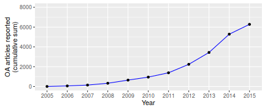
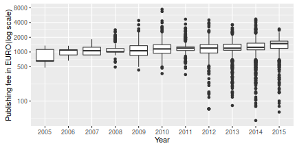

# Introduction

Publication fees, often paid by funders or universities, are a widely discussed open access business model. Yet, research and policy makers alike report a lack of information about publication fees, or article-processing charges (APC), sponsored on behalf of the authors. To overcome this problem, we suggest an openly available data-set with direct contributions from the institutions and with uniform information on payments made for publication fees. This approach promotes research and discussion on the role of this evolving business model in academic publishing, and supports academic institutions to plan for the future impact of fee-based open access publications on their budgets.

The rise of open access journals  matches the increasing relevance of publication fees in academic publishing [@Davis_2011; @Laakso_2012; @Pinfield_Review_2015]. To cover those fees, authors tend to make use of funding that grant agencies or academic institutions provide [@Suber_2012]. However, collecting information about what was funded is in most cases difficult. One reason why payments made for open access journal publications are often hard to track is that, on the one hand, they are fragmented across the budgets of funding agencies, research institutions, and libraries, and, on the other hand, taken from personal budgets. Furthermore, open access funding mostly exists in higher income countries, mainly to support research articles in the bio- and physical sciences [@Solomon_2011]. Personal budgets stand in contrast with those support structures and are likely used to cover low price publication fees [@Solomon_2011; @Bj_rk_2015]. Along with the fragmentation of payments, funding for open access publications lacks transparency because the parties involved - authors, universities, funders, publishers - do not release information on who pays for what nor the costs of publishing [@Bj_rk_learned_2014], very similar to the lack of transparency regarding journal subscriptions [@Lawson_Meghreblian_2015]. It also remains unclear which factors contribute to price formation.[^4b] While fixed prices for individual articles are common, agreements between publishers and institutions often provide discounts and publishers sometimes waive publication fees for authors from low-income countries [@BJ_RK_2012; @Lawson_waiver_2015]. Other factors leading to a complex landscape of variable pricing schemes [@Pinfield_2015] include submission or page charges [@BJ_RK_2012]. Hybrid journals substantially add to this complexity, because comprehensive offset systems to avoid paying for the same article twice (through subscription and publication fee) are rare, leading to double dipping and adding to the total cost of scholarly publishing [@Pinfield_2015].

The great variety and lack of transparency create difficulties for research funders and libraries. Owing to the fragmentation of payments, funding paths in open access publishing remain obscure. To increase transparency, some research funders have begun collecting and publishing expenditures for open access journal articles as open data. As per definition, open data is data that "can be freely used, modified, and shared by anyone for any purpose" [@OpenDataHandbook]. Therefore, opening up information about the funding of open access journal articles promises to enhance the discussion about current and future business models in academic publishing. To our knowledge, the first research funders providing such data were the Wellcome Trust [@wellcome_apc] and the Austrian Science Fund FWF [@fwf_apc], who both released data on publication fees they had funded. Jisc, a national consortia, followed by collecting data from higher-education institutions in the UK [@Lawson_data_2015]. Disclosed as publicly available spreadsheets, these data-sets self-report expenditures along with bibliographic information, including title, journal and publisher, persistent identifier to the publisher's version, and a link to a deposit in a subject repository. Curatorial efforts focused on the disambiguation of publisher and journal titles as well as on detecting duplicates. Crowd-sourcing data cleaning activities through a Google spreadsheet in combination with checks against bibliographic sources massively improved the Wellcome Trust spending data (see comments in @wellcome_apc).

The open access landscape in Germany, which is the focus of this article, shares problems of lack of transparency regarding funding schemes and costs discussed above. The Deutsche Forschungsgemeinschaft (DFG), the largest research funder in Germany, has been encouraging open access publishing since years. It launched its "Open-Access Publishing" program in 2009 that has strongly influenced the support of open access publication fees through funds managed by university libraries.[^3] With this program, the DFG aims to help universities to establish support structures for publishing in fee-based open access journals. To reduce administrative burdens, grantees agree not only to reimburse the bills on behalf of the researchers they support, but also to look for ways to improve the handling of those financial transactions. Examples include central invoicing schemes or other types of publisher agreements. They are also required to report the institutional publication output and their fees paid for open access journal articles to the DFG on a regular basis, and to present their strategy to sustain the funds when DFG’s initial support runs out lately in 2019. The DFG enforces a set of criteria grantees have to comply with, leading to similar implementations for supporting open access publishing across German universities: these criteria exclude sponsoring of articles in hybrid journals, and the funding of articles whose publication fee exceeds 2,000 € (excluding VAT) [@Fournier_2013]. Research institutes organized in the Fraunhofer-Gesellschaft, Helmholtz-Gemeinschaft, Leibniz-Gemeinschaft, and Max-Planck-Gesellschaft are not eligible for this funding program, contributing to the diversity of schemes in Germany. In response, some organizations have adopted similar processes to support authors. The Max-Planck-Gesellschaft operates their long-lasting open access activities, including handling spending and publisher agreements centrally, through the Max Planck Digital Library [@Schimmer_2013; @Sikora_2015], while the Leibniz-Gemeinschaft set up a dedicated open access fund in 2016.

The growing share of articles published in fee-based open access journals in recent years has led to calls for an unified approach towards funding of publication fees. The Allianz der Wissenschaftsorganisationen[^10c], representing all major research organizations in Germany, thus marks transparency as a major means to sustain an "adequate open access publication system" [@allianz]. However, there are various ways to achieve this goal. The existing approaches (see above) are centristic and depend on a single institution to collect and analyze the data. We propose a different approach: In May 2014, Bielefeld University Library began to share its expenditures and, under the umbrella of the the working group "Electronic Publishing" of Deutsche Initiative für Netzwerkinformation (DINI)[^11], invited others to contribute as well. Reflecting the increasing demand for publicly available data, the "Open APC initiative" was born. Contributions from Universität Regensburg and Universität Hannover followed. As of writing, 29 universities and research institutes reported their data to the project. This initiative aims to foster transparency of open access publication fees by curating and sharing a uniform set of data.

In this paper, we present the technical workflow of the Open APC initiative. We describe how the data-set is curated and which tools are used in order to produce, disseminate, and preserve the Open APC spending data. Presenting our results, we, in particular, analyze and discuss how and to what extent the use of the CrossRef index accommodates the demand of disambiguated bibliographic information about journals and publishers when reporting about funding of open access journal articles. CrossRef, a Digital Object Identifiers (DOI) registration agency for scholarly literature, associate these persistent links with metadata that publishers and societies contribute.  Our analysis of the data contributed so far illustrates possible ways of using this data-set. We are able to show the importance of reusable open data and encourage other possible data contributors to also publish their payment information through this initiative. The goal is to strengthen the insight on open access funding, enabling institutions to better plan for a transition to open access.

# Open APC Data Pipeline

The major goal of the Open APC initiative is to gain insight on expenses for publication fees by collecting data directly from the institutions paying for their authors. These institutions can report best on the most important part: How much they have spent for a particular article. It is a dedicated open data project, designed around the idea of sharing the collected data as permissive as possible. At its core is a data pipeline to collect and to process the contributed data. In this chapter, we discuss the general idea of this pipeline and describe its stages: data submission (by spending institutions), merging contributions, re-using data, preserving data, and engaging with our communities to increase participation.

## General idea

We followed the idea to "keep things simple" and to "engage early and engage often" with data providers and potential users for open data projects to be successful [@OpenDataHandbook]. We therefore chose a simple data scheme, built our pipeline around the popular social coding platform GitHub, and re-used information from bibliographic indexes.

We followed good practice of other projects to guarantee that the data is as open as possible. From the beginning, we emphasized that this also includes information on submissions—date of submission, contributors, etc.—and publishing the data in an open file format.
The institutions self-report data and updates at different times to be integrated into the curated data-set. Thus, tracking initial submissions and updates is particularly important.

All data and documentation reside on GitHub. Git, a distributed version control system, powers GitHub and allows people to collaborate on software projects. Git keeps a log of every change in the source code and manages to synchronize local copies of the very same software repository. Because of its distributed and social characteristics, Git, in general, and GitHub, in particular, are  suitable for researchers to mutually curate and share research artifacts including data-sets, analyses, or visualizations [@Ram_2013].

In addition to GitHub, bibliographic indexes are an essential part of our data pipeline. We use CrossRef to retrieve disambiguated metadata for every funded article. This ensures automatic authority control for journal and publisher titles, which are the most appropriate levels of aggregations when analyzing expenditures for open access articles [@Pinfield_2015]. We also check automatically the indexing status of each article in Europe PubMed Central, a large bibliographic index for life-science literature, the multidisciplinary database Web of Science, and the open access source Directory of Open Access Journals (DOAJ).

## Data Submission

Participants use a template to self-report data (see table *(fixme)*). Data structured in this way enables the fetch of additional data from external sources, and ensure that the merge is done correctly. By collecting as little data as possible from the institutions, this approach ensures that adapting and adding to the scheme is possible.

The required items in the template are:

|column  		|description | Requirement level |
|:--------------|:---------|:----|
| `institution` | Top-level organisation which covered the fee, e.g. MPG | mandatory |
| `period` 		| Year of APC payment (YYYY) | mandatory |
| `euro` 		| The amount that was paid in EURO. Includes VAT and additional fees | mandatory |
| `doi` 		| Digital Object Identifier | mandatory |
| `is_hybrid` 	| Has the article been published in a toll access journal?| mandatory |
| `publisher` 	| Name of publication house that has charged the fee | optional |
| `journal_full_title` | Full name of periodical in which the article appeared | optional |
| `issn` 		| International Standard Serial Number. If more than one are available, collapse with `;` | optional |

Table: Mandatory and optional data elements for disclosing funding of open access publication fees

The data scheme reflects how the Wellcome Trust [@wellcome_apc], the Austrian Science Fund FWF [@fwf_apc] and Jisc [@Lawson_data_2015] organized data about expenses for open access publication fees. The project requests items that are already present on institutional level for internal reporting purposes [@Pinfield_2015]. The guidance also refers to the principles of *tidy data* [@tidy-data]. This responds to issues encountered in the UK, when the inexperienced use of spreadsheet software like Excel lead to misaligned tables [@woodward_2014]. The principle of tidy data intends to reduce data cleaning efforts before statistical analyses, the three principles of tidy data state that, firstly, each variable must form a column, secondly, each observation must form a row, and, finally, each type of observational unit must form a table.  To prevent messy data, it is also crucial that unknown values are not left empty. In our case, we use the R convention `NA` for handling those values.

`"Hannover U",2013,1241.02,"10.1371/journal.pone.0063501",FALSE`
Sample data contribution displaying mandatory information

Data contributors collect the data in different systems. After preparing the data, it must be exported in the csv standard, a plain text file format for tabular data supported by most spreadsheet software, and stored into a folder that also contains a README file. Written in plain text or Markdown, the README contains information about the data-set and the contributing institution. The submission itself is facilitated through GitHub's pull request mechanism: contributors fork the initiative's data, add their contributions, upload their modified copy to their repository, and request importing their data into the initiative's repository by alerting the maintainers through sending a "pull request".

## Data curation

<!--Bielefeld University Library acts as curator and merges the contributed spreadsheets into one general data-set.--> By using open software, we, as curators, retrieve additional data elements based on the article's DOI. This avoids manual cleaning efforts the other initiatives were faced with. Because the DOI is at the center of the data curation, data normalization starts with a check of the DOI columns for possible duplicates and white space. CrossRef is then queried for article metadata matching the particular DOI.

CrossRef provides several APIs to search for bibliographic information it indexes during DOI registration. In our case, we query the CrossRef REST API[^18] by using content negotiation. As resource type, we request the format `application/vnd.crossref.unixsd+xml`, which main function is to support text mining activities.[^5] The advantage of this XML format is that it distinguishes full and abbreviated journal titles as well as the media types of ISSNs, the International Standard Serial Number used to identify journals. It also contains license information and disambiguated publisher information, thus avoiding confusion about licensing and naming of publisher houses [@woodward_2014].

As a client, we use the R package `rcrossref` [@rcrossref] developed and maintained by the rOpenSci initiative.[^6] With the function `cr_cn`, the client supports all linking types. Table 3 *(fixme)* summarizes the data elements we retrieve:

|Source     	|Data element  |Description                     |
|:--------------|:---------|:-----------------------------------------------|
|CrossRef   	|`publisher` |Title of Publisher             |
|CrossRef   	|`journal_full_title` |Full Title of Journal  |
|CrossRef   	|`issn` |International Standard Serial Numbers (collapsed) |
|CrossRef   	|`issn_print` |ISSN print |
|CrossRef   	|`issn_electronic`  |ISSN electronic        |
|CrossRef   	|`license_ref`  |License of the article     |
|CrossRef   	|`indexed_in_crossref`  |Is the article metadata registered with CrossRef? (logical)    |
|EuropePMC    	|`pmid`  |PubMed ID                 |
|EuropePMC    	|`pmcid` |PubMed Central ID         |
|Web of Science |`ut` |Web of Science record ID             |
|DOAJ           |`doaj` |Is the journal indexed in the DOAJ? (logical)    |

Table: Sources used to automatically enrich the Open APC data-set

In addition to CrossRef, the indexing status for each article in Europe PubMed Central and the Web of Science is checked. Europe PubMed Central, one of the largest database for life science literature, offers a public RESTful web services to access more than 24 million records and 870,000 deposited open access articles [@epmc_2014]. Information from the Web of Science, which provides indexing of open access journal literature [@Walters_2011], is retrieved through the Thomson Reuters Article Match Retrieval Service[^8] interface which is available to Bielefeld University Library as part of its subscription. Finally, an automatic match with the DOAJ, a comprehensive and openly available registry of open access journals, is performed.

After disambiguating and enriching the data, we append the rows into a single csv file, `data/apc-de.csv`, containing consistent records of all expense. The data additions are logged with Git and pushed to the source code repository on GitHub.

## Re-use

We use the main README file of our data repository as general guide to the Open APC data collection and to present sample analyses. The README itself is written in R Markdown, an authoring format that allows for the combination of the R code, results, and text within one document.[^10] Compiled with knitr [@knitr], the README reflects new data submissions after every build. Sample results include tables summarizing the number of supported articles and cost per institution as well as figures that illustrate the distribution of publication fees.

A blog hosted on GitHub presents all new data contributions.[^12] Since it is technically based on Jekyll,[^13] a static site generator, we can use the same development cycle we have for producing the README files. We write blog posts, which include information about the providing institution and the contributed data-set, in R Markdown, build the posts with `knitr` and, then, log and deploy the files to GitHub with Jekyll, making it possible to reproduce the analytical steps.

## Preservation

The data-set itself is licensed under the Open Database License (ODbL) v1.0,[^13a] allowing re-use under conditions of attribution and share-alike. To preserve the collected data, a GitLab installation hosted by Bielefeld University and administrated by Bielefeld University Library ,mirrors a copy of the GitHub repository and is accessible via a DOI.

To provide reference points to particular data contributions, unique version names refer to data submissions or other changes in the source code, which will be then distributed as releases through GitHub. This approach allows others to not only to refer, but also to re-use or self-archive particular snapshots of the data.

## Engagement

Besides technical measures, social aspects are crucial to make an open data initiative successful. For the Open APC initiative, we focus on engaging librarians and collaborating within existing networks. In Germany, the working group "Elektronisches Publizieren" of the Deutsche Initiative für Netzwerkinformation (DINI) coordinates these efforts.[^11] The initiative aims at increasing participation through the use of social media, workshops, and regular community calls.

A GitHub wiki[^15] shares guidance and interim reports. If participants want to report bugs or propose new functionality, GitHub's "issues" mechanism involves users while keeping track of the discussion. To ensure a constructive environment for all participants, we refer to the code of conduct from Contributor Covenant.[^17]

<!--From our experience, the process described in this chapter has played an important role in getting many institutions to participate in voluntarily sharing information on their expenses for APCs. The data scheme has been revised at the end of 2015, and transformation to a new scheme has happened without any complications. Further adaption, e.g. adding subject classification if a suitable source can be identified, is possible. We encourage institutions and researchers to further work on the data pipeline while preserving its openness and the low entry barrier for new data contributors.-->

# Results

## Cost Data

On February 19th 2016, the Open APC initiative covered 6,279 articles, whose publication fees were centrally paid by 29 German universities and research institutions. The number of supported open access journal articles, which were reported to this initiative, grew over several years (see Figure 1). While one institution disclosed 5 payments made in 2005, the majority shared their expenditures from 2013 onwards. With 1,846 articles, the year 2014 was best represented in our data-set. Because of a time lag between payments made and reporting them to the Open APC initiative, only 17 institution were able to partly contribute their cost data for 2015 at the time of this analysis.

Among all articles, fees amounted to 8,039,339 € including VAT, the average payment was 1,280 € and the median value 1,209 € . Figure *(fixme: figure number)* shows the large price variation among the articles. The disclosed publication fees ranged from 40 € to 7,419 €. However, the average price paid varied somewhat between 2011 and 2014 (1249 - 1289 €). We also observe that 5,967 (95%) of the publication fees were paid in accordance with the DFG price cap of 2,000 €. Whereas related open data initiatives in Austria and the UK reported a large share of spending for hybrid journal articles, the situation in Germany is different: only  53 articles in hybrid journals were reported by 3 out of 29 research institutions, accounting for 0.84 % of the overall payments.

The number of APC payments per institutions varied considerably (see Table *(fixme: figure number)*). With 2,796 reported articles, the Max Planck Society contributed 45 % of the overall submissions. In contrast, the two universities of technology, TU Clausthal and TU Ilmenau, who recently begun to set up support structures for fee-based open access journal articles, shared payments made for four articles each.

|Institutions                                | Articles funded| Total (in €)|  Mean| Median| Minimum| Maximum|
|:-------------------------------------------|---------------:|------------:|-----:|------:|-------:|-------:|
|MPG                                         |           2,796|    3,577,537| 1,280|  1,165|     104|   7,419|
|Muenchen LMU                                |             365|      463,491| 1,270|  1,299|     496|   2,023|
|Goettingen U                                |             313|      409,930| 1,310|  1,285|     180|   4,121|
|KIT                                         |             291|      344,131| 1,183|  1,178|      69|   3,731|
|Regensburg U                                |             280|      331,718| 1,185|  1,183|      77|   4,403|
|Bielefeld U                                 |             261|      321,475| 1,232|  1,232|     142|   2,103|
|Giessen U                                   |             243|      326,082| 1,342|  1,247|      81|   4,498|
|Konstanz U                                  |             223|      304,182| 1,364|  1,342|      40|   2,072|
|Heidelberg U                                |             215|      308,348| 1,434|  1,500|      60|   2,042|
|Wuerzburg U                                 |             207|      286,543| 1,384|  1,447|     105|   2,514|
|Leipzig U                                   |             168|      236,376| 1,407|  1,481|     341|   2,047|
|Duisburg-Essen U                            |             114|      136,911| 1,201|  1,214|     238|   1,982|
|FU Berlin                                   |             104|      139,284| 1,339|  1,283|     220|   2,000|
|TU Muenchen                                 |             103|      123,054| 1,195|  1,269|     131|   2,046|
|FZJ - ZB                                    |              94|      109,701| 1,167|  1,091|     370|   2,784|
|TU Dresden                                  |              78|       96,046| 1,231|  1,242|     200|   1,944|
|Bochum U                                    |              70|       91,951| 1,314|  1,437|     100|   2,042|
|Hannover U                                  |              69|       90,259| 1,308|  1,241|     149|   2,159|
|GFZ-Potsdam                                 |              60|       69,625| 1,160|  1,062|     438|   4,403|
|Bayreuth U                                  |              57|       64,519| 1,132|  1,104|      82|   1,969|
|TU Chemnitz                                 |              36|       37,826| 1,051|  1,142|      78|   2,123|
|Kassel U                                    |              35|       35,550| 1,016|  1,142|     150|   1,861|
|MDC                                         |              34|       61,519| 1,809|  1,348|     491|   4,700|
|Hamburg TUHH                                |              24|       32,789| 1,366|  1,466|     300|   2,027|
|Bamberg U                                   |              16|       15,932|   996|    960|      90|   2,010|
|Dortmund TU                                 |               9|        8,238|   915|    900|     155|   1,738|
|INM - Leibniz-Institut für Neue Materialien |               6|        8,505| 1,418|  1,492|     237|   2,454|
|TU Clausthal                                |               4|        3,771|   943|    969|     460|   1,374|
|TU Ilmenau                                  |               4|        4,043| 1,011|  1,201|     178|   1,462|

## CrossRef indexing

Along with the price information, participating institutions were required to identify funded articles by their DOI. They were reported for 6,250 out of 6,279 articles. Of those, 6,228 were indexed in CrossRef, representing 99  % of all funded publications. The reasons why articles identified by a DOI were not registered with CrossRef differed. Some journals were not indexed by CrossRef at the time of our study but either by DataCite (Journal of new frontiers in spatial concepts published by KIT Scientific Publishing) or Medra (DIE ERDE: Journal of the Geographical Society of Berlin). In other cases, either the DOI did not refer to the full text despite the fact that the journal was indexed on a regular basis (compare <http://doi.org/10.1186/1471-2105-13-S19-S7> with <http://bmcbioinformatics.biomedcentral.com/articles/10.1186/1471-2105-13-S19-S7>)or the resource type could not be retrieved, although the DOI resolves ("10.1186/s12885-015-1795-7").

## Cost data by publisher and journal

The DOI was used to automatically fetch publisher and journal information for each article from the CrossRef REST API. Table *(fixme: figure number)* shows the top ten publishers in terms of payments made, representing 92 % of the spending for publication fees. In total, payments were made to  117 publishing houses. In comparison with data from the UK, full open access publishers have a greater share on total spending. @Pinfield_2015, for instance, reported remarkably lower numbers for the open access publishers MPDI, Copernicus, and Hindawi.

|Publisher                         | Articles funded| Total (in €)|  Mean| Median| Minimum| Maximum|
|:---------------------------------|---------------:|------------:|-----:|------:|-------:|-------:|
|Springer Science + Business Media |           1,751|    2,301,460| 1,314|  1,327|      81|   2,042|
|Public Library of Science (PLoS)  |           1,486|    1,972,460| 1,327|  1,202|     556|   2,790|
|Frontiers Media SA                |             783|    1,014,279| 1,295|  1,106|      77|   2,380|
|Copernicus GmbH                   |             676|      957,869| 1,417|  1,299|     104|   7,419|
|IOP Publishing                    |             657|      674,644| 1,027|    943|     589|   1,950|
|MDPI AG                           |             151|      166,948| 1,106|  1,170|     154|   2,055|
|Hindawi Publishing Corporation    |              91|       87,846|   965|    926|     200|   2,159|
|Optical Society of America (OSA)  |              78|      118,798| 1,523|  1,599|     499|   3,731|
|Nature Publishing Group           |              60|      103,174| 1,720|  1,386|     934|   4,403|
|Wiley-Blackwell                   |              57|       89,722| 1,574|  1,457|     491|   3,000|
|other                             |             489|      552,139| 1,129|  1,058|      40|   4,700|

Most of the funding went to Springer Science + Business Media, especially profiting from the merge with the former full open access publisher BioMed Central. In contrast, other established publishing houses such as Elsevier and Wiley-Blackwell rank lower, because they mostly publish hybrid journals, which were not well represented by the Open APC initiative. Table *(fixme)* also illustrates the variation across and within publishers, which confirms earlier findings [@Pinfield_2015].

|Journal                                        | Articles funded| Total (in €)|  Mean| Median| Minimum| Maximum|
|:----------------------------------------------|---------------:|------------:|-----:|------:|-------:|-------:|
|PLOS ONE                                       |           1,252|    1,500,643| 1,199|  1,185|     749|   1,809|
|New Journal of Physics                         |             653|      668,829| 1,024|    943|     589|   1,856|
|Atmospheric Chemistry and Physics Discussions  |             254|      400,183| 1,576|  1,410|     234|   7,419|
|Frontiers in Psychology                        |             241|      321,747| 1,335|  1,142|      77|   2,123|
|BMC Genomics                                   |             125|      164,017| 1,312|  1,273|     920|   1,926|
|Biogeosciences Discussions                     |             115|      173,084| 1,505|  1,331|     664|   3,641|
|BMC Bioinformatics                             |             104|      128,452| 1,235|  1,230|     655|   1,661|
|Frontiers in Human Neuroscience                |             100|      130,243| 1,302|  1,106|     575|   2,000|
|Frontiers in Plant Science                     |              91|      104,067| 1,144|  1,106|     551|   2,380|
|Atmospheric Measurement Techniques Discussions |              86|      122,927| 1,429|  1,325|     535|   3,709|
|other                                          |           3,258|    4,325,147| 1,328|  1,333|      40|   4,700|

Prices also varied within single journals. Based on the number of articles paid for, table *(fixme)* illustrates the top ten out of 640 journals. Payments to these ten journals represent 48 % of all payments. In the case of *Atmospheric Chemistry and Physics Discussions*, the price range can be explained by the fact that this journal charges per page and also takes the submission's file format into consideration.

The data-set confirms the leading role of "mega-journals" in open access publishing, including the multidisciplinary PLOS ONE and the journals New Journal of Physics, Atmospheric Chemistry and Physics Discussions and Frontiers in Psychology, all of which publish contributions from all branches of their discipline. In general, an estimated 14 out of more than 10,000 journals registered in DOAJ in 2015 accounted for up to 15–20 % of all articles published in full open access journals [@Bj_rk_2015].

# Discussion

The results show that the technical workflow of the Open APC initiative improves the way information about spending for open access publication fees is collected and shared. The workflow benefits from openly available tools and the social coding platforms GitHub, both of which are well established and suited to increase transparency in research [@Peng_2011; @Ram_2013]. For 99 % of the articles, CrossRef provided bibliographic information, which substantially contributed to a uniform data-set about formerly fragmented payments made for open access articles.

Although CrossRef provides disambiguated journal titles and publisher names, derivations from CrossRef metadata curation as well as the context of aggregation must be made clear. In particular, problems persist on how to deal with name changes and ongoing mergers. For example, the publisher Public Library of Science (PLOS) has changed its acronym from "PLoS" to "PLOS", which is reflected in the CrossRef metadata for records from 2015 onward. We therefore normalized all PLOS journal titles in order to secure unique reference to these journals. Another publisher affected is "The Optical Society," formerly "Optical Society of America". Because the ownership of publishing houses can become combined, dealing with mergers is also essential to make cost data comparable. Jisc data, for instance, differentiate between the full open access publisher BioMed Central and the traditional publisher Springer, concluding that "traditional publishing houses" lean on the hybrid model [@Pinfield_2015]. This stands in stark contrast to our approach, in which CrossRef metadata reflects the merger of BioMed Central and Springer, resulting in Springer Science + Business Media to be the best represented publisher for articles in full open access journals in the Open APC data-set. Another approach to ensure names are consisent, but that we have not evaluated yet, is to use CrossRef's identifiers for journals and publishers instead.[^19]

Because of the dynamic landscape of academic publishing and its representation in CrossRef's data curation efforts, it is important to consider the time-frame of metadata aggregation. In our case, we re-used metadata shortly after the data submission. However, for some cost analysis—for instance to prepare negotiations with publishers on future schemes to fund open access journal articles—it could be more feasible to re-normalize the complete data, thus use incremental metadata updates that the CrossRef API supports to assess the current potential of future funding. While licensing information is incompletely covered in the CrossRef index, the growing importance of facilitating text mining may result in more and more publishers adding this information in future.

Participation is voluntary. Therefore, not all institutions in Germany that provide central funding of publication fees contribute cost data to this initiative. In a qualitative survey that also asked, why German institutions are reluctant to share their cost data through the Open APC initiative, one institution feared that increase in transparency would allow publishers to adjust prices in their favor. Others pointed out that the workload to produce such a data-set could be too extensive [@deppe_2015].

While there may still be institutions that have no overview of their APC spending, we would like to emphasize that reporting data that is already available within an institution to the Open APC initiative does not imply a lot of additional work. The central idea behind this initiative is to make it as easy as possible to submit data to it. Being able to combine that data into one standardized data-set increases transparency and comparability and gives institutions a better understanding of the overall development—which is crucial to prepare for an open access transformation. We cannot see the harm of increased transparency; in fact, not knowing how much is spent is undoubtedly a disadvantage in dealing with publishers.

As suggested by @Pinfield_2015, extending the data template to include information about funders or whether special agreements with publishers applied, would even increase the efforts needed to participate. However, with the growing demand for action in areas like the large-scale transition of toll-access journals to open access [@Schimmer_Geschuhn_Vogler], an updated data template may help institutions to better comply with these changes in science policy in the future. From our experience, another barrier is the lack of skills in version control: the data submission itself is not always made directly by the participating institutions. Instead, participants sent files to Bielefeld University Library with the request to make them available on GitHub on their behalf.

Future work needs to focus on analyzing the cost data. Of particular interest are questions concerning the coverage of central funding schemes in comparison with open access publication output in general, and the use of other means to cover publication fees in particular. The Open APC initiative does not cover personal budgets or make price reductions explicit, but studies suggest that there is a possible gray area [@BJ_RK_2012; @Bj_rk_2015; @Lawson_waiver_2015]. Existing study designs could be re-applied to examine the relationship between price, on the one hand, and indexing coverage, journal prestige or management costs on the other [@Walters_2011; @Bj_rk_scientometrics_2015, @Pinfield_2015]. This, in turn, helps to address the central question of future business models in scholarly publishing from an international perspective [@Pinfield_2015].

# Conclusion

The purpose of the Open APC initiative is to gain better insight on spending for open access. The main operational idea—to make data submission easy by building upon existing data and by using popular open tools and data bases—has proven to be a feasible approach and to scale well. Starting with a few institutions, the integration of further data contributors has not been a problem. While we use article metadata reported by publishers to CrossRef, we think it's best to collect information on how much has been spent at the sources: the institutions paying for APCs. We look forward to more data contributors to the initiative and to adapt this scheme to new analyses, additional data, or international sources. The Open APC initiative can serve as an example of the value that open data, open source software, and the knowledge and skills of tech-savvy librarians add to modern tasks of libraries.

# Acknowledgment

We thank Andrea Hacker and Ada-Charlotte Regelmann for valuable comments to the first draft of this paper. We also thank Christoph Broschinski, Vitali Peil and Dirk Pieper, the members of the DINI working group "Electronic publishing", and all data contributors[^20] of the Open APC initiative.

# Literature

[^1]: Comprehensive list of business and revenue models of open access journals: <http://oad.simmons.edu/oadwiki/OA_journal_business_models>

[^2]: <https://github.com/openapc/openapc-de>

[^2a]: Project summary available at <https://github.com/OpenAPC/openapc-de>. The initiative is now supported by the INTACT project: http://www.intact-project.org/.

[^2b]: However, it should be noted that the administrative costs of processing invoices for a large number of articles are not measured in this project.

[^3]: Guidelines for the funding program can be found here: <http://www.dfg.de/formulare/12_20/>

[^3a]: We are sure that some universities with DFG-funded publication funds pay for APCs higher than 2,000 EUR. They have to make sure they don't use the funder's money for these articles, and this maybe explains why some institutions are reluctant to report on these APCs. Scatter plots of all APC payments show that there are only very few APCs over 2,000 EUR.

[^4b]: These might include article processing, impact, rejection rates, management and investment, and profit margins. See @Van_Noorden_2013 for a general discussion and @Gumpenberger_2012 and @Bj_rk_scientometrics_2015 for discussions of journal impact and quality.

[^5]: CrossRed: Text and Data Mining for Researchers: <http://tdmsupport.crossref.org/researchers/>

[^6]: rOpenSci: <https://ropensci.org/>

[^7]: Europe PubMed Central RESTful Web Service: <https://europepmc.org/RestfulWebService>

[^8]: Thomson Reuters Article Match Retrieval Service: <http://wokinfo.com/directlinks/amrfaq/>

[^9]: <https://doaj.org/faq#metadata>

[^10]: <http://rmarkdown.rstudio.com/>

[^10c]: <http://www.dfg.de/en/dfg_profile/alliance/index.html>

[^11]: <http://dini.de/english/ag0/e-pub0/>

[^12]: <http://openapc.github.io>

[^13]: <https://jekyllrb.com/>

[^13a]: <http://opendatacommons.org/licenses/odbl/1-0/>

[^14]: <https://lists.uni-bielefeld.de/mailman2/cgi/unibi/listinfo/open-apc>

[^15]: <https://github.com/OpenAPC/openapc-de/wiki>

[^16]: <https://github.com/OpenAPC/openapc-de/issues>

[^17]: <http://contributor-covenant.org/>

[^18]: <https://github.com/CrossRef/rest-api-doc/blob/master/rest_api.md>

[^19]: <https://github.com/CrossRef/rest-api-doc/blob/master/rest_api.md#resource-components-and-identifiers>

[^20]: <https://github.com/OpenAPC/openapc-de#contributors>
