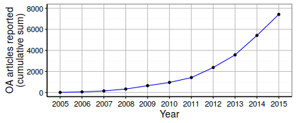
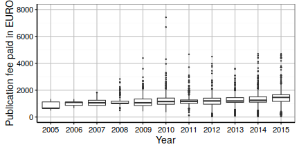

# Introduction{.unnumbered}

Publication fees, often paid by funders or universities, are a widely discussed open access business model. Yet, how and to what extent these activities are effective in terms of the number of supported research articles and associated costs remains under debate. This paper describes the Open APC initiative[^2], in which German universities and research organization share spendings on open access publication fees, and how it is currently implemented. More specifically, it addresses three problem areas when studying the economical effects of open access publishing: fragmentation of open access funding, variable pricing schemes and the comparison across research institutions. Such an approach extends methods and improves data collection activities for researchers and practitioners, as well as contribute to a better understanding of factors affecting the analysis of publication fees in open access publishing.

The rise of open access journals  matches the increasing relevance of publication fees in academic publishing [@Davis_2011; @Laakso_2012; @Pinfield_Review_2015]. To cover these fees, authors tend to make use of funding that grant agencies or academic institutions provide [@Suber_2012]. However, collecting information about what was funded is in most cases difficult. One reason why payments made for open access journal publications are often hard to track is that, on the one hand, they are fragmented across the budgets of funding agencies, research institutions, and libraries, and, on the other hand, taken from personal budgets. Furthermore, open access funding mostly exists in higher income countries, mainly to support research articles in the bio- and physical sciences [@Solomon_2011]. Personal budgets stand in contrast with those support structures and are likely used to cover low price publication fees [@Solomon_2011; @Bj_rk_2015]. Along with the fragmentation of payments, funding for open access publications lacks transparency because the parties involved - authors, universities, funders, publishers - neither release information on who pays for what nor the costs of publishing [@Bj_rk_learned_2014], a situation similar to the lack of transparency regarding journal subscriptions [@Lawson_Meghreblian_2015]. It also remains unclear which factors contribute to price formation.[^4b] While fixed prices for individual articles are common, agreements between publishers and institutions often provide discounts and publishers sometimes waive publication fees for authors from low-income countries [@BJ_RK_2012; @Lawson_waiver_2015]. Other factors leading to a complex landscape of variable pricing schemes [@Pinfield_2015] include submission or page charges [@BJ_RK_2012]. Hybrid journals substantially add to this complexity, because comprehensive offset systems to avoid paying for the same article twice, through subscription and publication fee, are rare, which, in turn, leads to the phenomena of "double dipping" in scholarly publishing [@Pinfield_2015].

This complex situation of fee-based open access publishing creates difficulties for researchers and practitioners alike. Because of fragmented payments, the extent of funding remains unclear. To increase transparency, some research funders have begun collecting and disclosing expenditures for open access journal articles as open data. As per definition, open data is data that "can be freely used, modified, and shared by anyone for any purpose" [@OpenDataHandbook]. Therefore, opening up information about the funding of open access journal articles promises to enhance the discussion about current and future business models in academic publishing. To our knowledge, the first research funders providing such data were the Wellcome Trust [@wellcome_apc] and the Austrian Science Fund FWF [@fwf_apc], who both released data on publication fees they had funded. The British not-for-profit company Jisc followed by collecting data from higher-education institutions in the UK [@Lawson_data_2015]. Disclosed as publicly available spreadsheets, these data-sets self-report expenditures along with bibliographic information, including title, journal and publisher, persistent identifier to the publisher's version, and a link to a deposit in a subject repository. Curatorial efforts focused on the disambiguation of publisher and journal titles as well as on detecting duplicates. In the case of the Wellcome Trust, crowd-sourcing data cleaning activities through a Google spreadsheet in combination with checks against bibliographic sources massively improved the spending data (see comments in @wellcome_apc).

The open access landscape in Germany, which is the focus of this paper, shares the general problems of in-transparency regarding funding schemes and costs as discussed above. The Deutsche Forschungsgemeinschaft (DFG), the largest research funder in Germany, has been encouraging open access publishing since years. It launched its "Open-Access Publishing" program in 2009 that has strongly influenced the support of open access publication fees through funds managed by university libraries.[^3] With this program, the DFG aims to help universities to establish support structures for publishing in open access journals where authors are requested to pay a publication fee. To reduce administrative burdens, grantees agree not only to reimburse the bills on behalf of the researchers they support, but also to look for ways to improve the handling of those financial transactions. Examples include central invoicing schemes and related agreements between university libraries and publishers. Grantees are also required to report the institutional publication output and their fees paid for open access journal articles to the DFG on a regular basis, and to present the university-wide strategy to sustain the funds when DFG’s initial support runs out lately in 2019. The DFG enforces a set of criteria grantees have to comply with, leading to similar implementations for supporting open access publishing across German universities: these criteria exclude sponsoring of articles in hybrid journals, and the funding of articles whose publication fee exceeds 2,000 € (excluding VAT) [@Fournier_2013]. Research institutes organized in the Fraunhofer-Gesellschaft, Helmholtz-Gemeinschaft, Leibniz-Gemeinschaft, and Max-Planck-Gesellschaft are not eligible for this funding program, contributing to the diversity of schemes in Germany. In response, some organizations have adopted similar processes to support authors. The Max-Planck-Gesellschaft operates their long-lasting open access activities, including handling spending and publisher agreements centrally, through the Max Planck Digital Library [@Schimmer_2013; @Sikora_2015], while the Leibniz-Gemeinschaft set up a dedicated open access fund in 2016.

The growing share of articles published in fee-based open access journals in recent years has led to calls for an unified approach towards funding of publication fees. The Allianz der Wissenschaftsorganisationen[^10c], representing all major research organizations in Germany, thus marks transparency as a major means to sustain an "adequate open access publication system" [@allianz]. However, there are various ways to achieve this goal. The existing approaches in Austria and the United Kingdom have one institution in charge to collect and analyze the data. The history of the Open APC initiative is rather bottom-up: In May 2014, Bielefeld University Library began to share its expenditures for publication fees. The library put its approach to the working group "Electronic Publishing" of the Deutsche Initiative für Netzwerkinformation (DINI)[^11] as a basis for discussion, and invited others to participate. Reflecting the increasing demand for publicly available data, contributions from Universität Regensburg and Universität Hannover followed soon after. As of writing, 29 universities and research institutes voluntary reported their data to the Open APC initiative to be included into a unified data-set of all expenditures.

The aim of this study was to examine how much German universities and research organisations spent on open access publication fees until 2015. Drawing on self-reported data that German institutions openly shared through the Open APC initiative, the analysis focused on the amount of institutional payments for publication fees, and compared these findings with those from related Austrian and British initiatives. We also asked how thoroughly self-reported articles were indexed in CrossRef, a DOI minting agency for scholarly literature, and analysed how institutional spending per articles was distributed over publishers and journal titles. 

# Methods and Materials{.unnumbered}

We analysed self-reported cost data released by the Open APC initiative on May 13, 2016, to assess institutional spending on open access publication fees in Germany. In addition to administrative data about the amount paid per article including value added tax, the reporting institution, and the year of invoicing, we used information about whether an article was published in a fully or hybrid open access journal as well as the recorded DOI from the data-set.

Instead of re-using publisher and journal information contained in the Open APC data-set, we fetched bibliographic metadata for each article from CrossRef on May 19, 2016, on the basis of the reported DOI's. Although the Open APC initiative gathered metadata representing publishers and journals from CrossRef as well, this information was  retrieved at the time when the participating institutions submitted the cost information. 
However, CrossRef regularly updates metadata to represent ongoing mergers of publishing houses or name changes. A prominent example in this regard was the merger of the two large publishing houses Springer Business + Media and Nature Publishing Group announced on May 6, 2015, that now operates as Springer Nature. To reflect these changes in academic publishing, we decided to retrieve updated metadata from CrossRef for the whole Open APC data-set. 

As a client, we used the R package rcrossref [@rcrossref], developed and maintained by the rOpenSci initiative[^6], to access CrossRef's REST API. We requested the XML-based format `application/vnd.crossref.unixsd+xml` in which full and abbreviated journal titles as well as the media types of ISSN's, the International Standard Serial Number used to identify journals, were distinguished. It also contained disambiguated publisher information, thus avoiding confusion about naming of publisher houses other studies were faced with when working with self-reported data [@woodward_2014]. In cases where no bibliographic information could be obtained, we used the Open APC values. Since CrossRef is not the only registration agency for DOI's, but also the agencies DataCite and Medra mint DOIs for scholarly work, we furthermore obtained the DOI agency for each article with the help of the rcrossref client.

Data collection in this study also involved obtaining cost data from related open data initiatives. To compare self-reported spending on open access publishing by Germany universities and research organisations with that of other initiatives, we reviewed the openly available spreadsheets from the Wellcome Trust [@wellcome_apc], the Austrian Science Fund FWF [@fwf_apc] and Jisc. For analysis, we obtained the amount of overall spending on publications fees, as well as on charges to publish in fully open access journal articles. In the case of FWF, we gathered the cost information from accompanying reports. We used the spreadsheet data to summarize  Wellcome Trust's and Jisc's spending, and converted the prices from GBP to Euro in accordance with the average Euro foreign exchange reference rates provided by the European Central Bank. Our comparison between the open data initiatives focussed on the last two years 2014 and 2015.Since Wellcome Trust's spending was reported for the periods 2013 - 2014 and 2014 - 2015, we referred to the exchange rates of the full two-years as we could not determine the actual dates of spending. We excluded Jisc's spending in 2014 because full currency information in the data-set was not available. 

Data collection methods of the Open APC initiative and those of the others differed in some aspects. For instance, whereas the DOI was a mandatory element in the Open APC data template that the participating institution were required to report, publication identifier in the Wellcome Trust data might also be added through automated compliance checks. For this reason, and as our main focus is institutional funding for publication fees in Germany, we decided only to compare German spending with that of other initiatives, but not its size and distribution over publisher and journal titles, as well as the indexing coverage in CrossRef. However, we made use of the literature to discuss our findings in relation to the other initiatives.

# Results{.unnumbered}

## Cost Data{.unnumbered}

On May 13, 2016,[^16a] the Open APC initiative covered 7,417 articles whose publication fees were centrally paid by 30 German universities and research institutions until 2015. The number of supported open access journal articles grew over the years (see Figure 1). While one institution disclosed 5 payments made in 2005, the majority shared their expenditures from 2013 onwards. With 1,999 articles, the year 2015 was best represented in our data-set. However, 27 institutions contributed their cost data for 2015 at the time of this analysis, suggesting that there exits a time lag between payments made and reporting these spending to the Open APC initiative.

Among all articles, fees amounted to 9,627,537 € including VAT, the average payment was 1,298 € and the median value 1,231 € . Figure 2 shows the large price variation among the articles. The disclosed publication fees ranged from 40 € to 7,419 €. However, the average price paid varied somewhat during the period 2011 and 2014 (1239 - 1289 €). We also observe that 6,996 (94%) of the publication fees were paid in accordance with the DFG price cap of 2,000 €. Whereas related open data initiatives in Austria and the United Kingdom reported a large share of spending for hybrid journal articles, the situation in Germany is different: only  60 articles in hybrid journals were reported by 3 out of 30 research institutions, accounting for 0.81 % of the overall payments.

The number of APC payments per institutions varied considerably (see Table 3). With 2,856 reported articles, the Max Planck Society contributed 39 % of the overall submissions. In contrast, the two universities of technology, TU Clausthal and TU Ilmenau, who recently begun to set up support structures for fee-based open access journal articles, shared payments made for four articles each.

-------------------------------------------------------------------------
Institutions       Articles     Total   Mean   Median   Minimum   Maximum
                     funded                                              
---------------- ---------- --------- ------ -------- --------- ---------
MPG                   2,856 3,661,120  1,282    1,168        69     7,419

Goettingen              650   883,918  1,360    1,354       180     4,695
U                                                                        

KIT                     426   523,166  1,228    1,243        69     3,731

Regensburg              399   503,205  1,261    1,207        77     4,403
U                                                                        

Muenchen                365   463,491  1,270    1,299       496     2,023
LMU                                                                      

TU                      308   390,086  1,267    1,386       131     2,122
Muenchen                                                                 

Bielefeld               262   322,815  1,232    1,234       142     2,103
U                                                                        

Giessen                 243   326,082  1,342    1,247        81     4,498
U                                                                        

Konstanz                221   302,659  1,369    1,380        40     2,072
U                                                                        

Heidelberg              215   308,348  1,434    1,500        60     2,042
U                                                                        

Wuerzburg               207   286,543  1,384    1,447       105     2,514
U                                                                        

Leipzig                 173   243,873  1,410    1,471       341     2,055
U                                                                        

FZJ -                   158   196,869  1,246    1,177       370     3,700
ZB                                                                       

TU                      130   175,723  1,352    1,415       200     2,193
Dresden                                                                  

Duisburg-Essen          114   136,911  1,201    1,214       238     1,982
U                                                                        

FU                      106   142,671  1,346    1,292       220     2,000
Berlin                                                                   

GFZ-Potsdam             106   126,520  1,194    1,065       223     4,403

Bayreuth                 92   105,725  1,149    1,200        82     2,059
U                                                                        

Bochum                   71    93,546  1,318    1,438       100     2,042
U                                                                        

Hannover                 69    90,259  1,308    1,241       149     2,159
U                                                                        

MDC                      69   145,256  2,105    1,800       491     4,700

TU                       36    37,826  1,051    1,142        78     2,123
Chemnitz                                                                 

Kassel                   35    35,550  1,016    1,142       150     1,861
U                                                                        

Hamburg                  24    32,789  1,366    1,466       300     2,027
TUHH                                                                     

Potsdam                  24    32,128  1,339    1,386       916     2,116
U                                                                        

Bamberg                  22    23,663  1,076    1,009        90     2,010
U                                                                        

TU                       13    13,053  1,004      986       178     2,077
Ilmenau                                                                  

Dortmund                  9     8,238    915      900       155     1,738
TU                                                                       

TU                        8     6,999    875      918       181     1,724
Clausthal                                                                

INM -                     6     8,505  1,418    1,492       237     2,454
Leibniz-Institut                                                         
für                                                                      
Neue                                                                     
Materialien                                                              
-------------------------------------------------------------------------

Table: Institutions self-reporting expenditures for open access publications (in €)

## CrossRef indexing{.unnumbered}

Along with the price information, participating institutions were required to identify funded articles by their DOI. They were reported for 7,373 out of 7,417 articles. Of those, `my_apc %>% filter(indexed_in_crossref == TRUE) %>% nrow()` were indexed in CrossRef, representing `my_apc %>% filter(indexed_in_crossref == TRUE) %>% nrow() / my_apc %>% nrow() * 100`  % of all funded publications. The reasons why articles identified by a DOI were not registered with CrossRef differed. Some journals were not indexed by CrossRef at the time of our study but by the DOI agencies DataCite (Journal of new frontiers in spatial concepts published by KIT Scientific Publishing) and Medra (DIE ERDE: Journal of the Geographical Society of Berlin). In other cases, either the DOI did not refer to the full text despite the fact that the journal was indexed on a regular basis (compare <http://doi.org/10.1186/1471-2105-13-S19-S7> with <http://bmcbioinformatics.biomedcentral.com/articles/10.1186/1471-2105-13-S19-S7>) or the resource type could not be retrieved, although the DOI resolves (<http://doi.org/10.1186/s12885-015-1795-7>).

## Cost data by publisher and journal{.unnumbered}

We used the DOI to automatically fetch publisher and journal names for each article from the CrossRef REST API. Table 4 shows the top ten publishers in terms of payments made that represent 92 % of the spending for publication fees. In total, payments were made to  139 publishing houses. In comparison with data from the UK, full open access publishers have a greater share on total spending. @Pinfield_2015, for instance, reported remarkably lower numbers for the open access publishers MPDI AG, Copernicus GmbH, and Hindawi Publishing.

-----------------------------------------------------------------
Journal           Articles     Total   Mean   SD   Median   Range
                    funded                                       
--------------- ---------- --------- ------ ---- -------- -------
Springer             2,167 2,948,697  1,361  387    1,385   80.92
Nature                                                    -- 4403

Public               1,680 2,243,128  1,335  321    1,207  555.66
Library                                                        --
of                                                        2790.27
Science                                                          
(PLoS)                                                           

Frontiers              906 1,186,283  1,309  424    1,142   77.35
Media                                                     -- 4179
SA                                                               

Copernicus             841 1,160,450  1,380  658    1,277   69.12
GmbH                                                           --
                                                          7418.88

IOP                    677   699,137  1,033  228      953  374.77
Publishing                                                -- 1950

MDPI AG                208   236,729  1,138  453    1,177  154.43
                                                               --
                                                          2054.68

Hindawi                120   125,495  1,046  538      947  174.99
Publishing                                                     --
Corporation                                               2225.22

The                    111   176,665  1,592  392    1,626  498.62
Optical                                                        --
Society                                                   3731.09

Wiley-Blackwell         78   126,148  1,617  467    1,601  490.58
                                                          -- 3065

Oxford                  64   118,225  1,847  793    1,741   297.5
University                                                     --
Press                                                      4498.2
(OUP)                                                            

Other                  565   606,578  1,074  840      922   40 --
                                                          4699.61
-----------------------------------------------------------------

Table: Publication fees paid per publisher (in €)

Most of the funding of publication fees in Germany went to the publisher Springer Science + Business Media, especially profiting from the merge with the former full open access publisher BioMed Central. In contrast, other established publishing houses such as Elsevier and Wiley-Blackwell rank lower, presumably because they mostly publish hybrid journals, which were not well represented in our data-set at the time of the study. Table 4 also illustrates the variation across and within publishers, which confirms earlier findings [@Pinfield_2015].

----------------------------------------------------------------
Journal          Articles     Total   Mean   SD   Median   Range
                   funded                                       
-------------- ---------- --------- ------ ---- -------- -------
PLOS                1,433 1,745,513  1,218  130    1,198  748.71
ONE                                                           --
                                                          1808.8

New                   673   693,322  1,030  225      953  374.77
Journal                                                       --
of                                                        1856.4
Physics                                                         

Atmospheric           281   437,903  1,558  776    1,403  233.86
Chemistry                                                     --
and                                                      7418.88
Physics                                                         
Discussions                                                     

Frontiers             271   363,794  1,342  429    1,142   77.35
in                                                            --
Psychology                                               2122.81

BMC                   135   179,592  1,330  205    1,276  920 --
Genomics                                                    1926

Biogeosciences        127   187,716  1,478  548    1,313  663.55
Discussions                                                   --
                                                         3641.47

BMC                   113   142,680  1,263  217    1,244  655 --
Bioinformatics                                           1661.24

Frontiers             107   126,763  1,185  408    1,106  551.04
in                                                       -- 2380
Plant                                                           
Science                                                         

Atmospheric           107   143,782  1,344  585    1,203   428.4
Measurement                                                   --
Techniques                                               3709.44
Discussions                                                     

Frontiers             106   140,065  1,321  415    1,106  575 --
in                                                          2000
Human                                                           
Neuroscience                                                    

Other               4,064 5,466,407  1,345  557    1,350   40 --
                                                         4699.61
----------------------------------------------------------------

Table: Publication fees paid per journal (in €)

Prices also varied within single journals. Based on the number of articles paid for, Table 5 illustrates the top ten out of 732 journals. Payments to these ten journals represent 45 % of all payments. In the case of Atmospheric Chemistry and Physics Discussions, the price range can be explained by the fact that this journal charges per page and also takes the submission's file format into consideration.

The data-set finally confirms the leading role of "mega-journals" in open access publishing, including the multidisciplinary PLOS ONE and the journals New Journal of Physics, Atmospheric Chemistry and Physics Discussions and Frontiers in Psychology, all of which publish contributions from all branches of their respective discipline. In general, an estimated 14 out of more than 10,000 journals registered in DOAJ in 2015 accounted for up to 15–20 % of all articles published in full open access journals [@Bj_rk_2015].

# Discussion{.unnumbered}

In Germany, institutional spending on open access publication fees has increased over the years. With a share of …, the majority of open access articles German institutions reported to the Open APC initiative were published in fully open access journals. This presumably reflects the DFG funding policy which excludes the support of articles published in hybrid open access journals. The DFG has been financially supporting the implementation of central publication funds at more than 30 German universities since 2009. However, reviewing self-reported cost data from funders or countries that also support hybrid open access journals or open access books revealed a smaller proportions of payments in favor of articles in fully open access journals. Since open access publication fee spending is generally fragmented, we cannot answer whether German researchers avoid opting for open access when publishing in hybrid journals or use other budgets to pay publication fees required to make their work open access through these kind of journals. 

In our study, CrossRef thoroughly indexed the analysed open access journal articles. Metadata representing publisher and journal titles could be gathered for 99 % of the self-reported article and successfully merged with the Open APC cost data. Using metadata from CrossRef, therefore, could reduce the extensive validation work of bibliographic information in self-reported data-sets on open access publication fees provided that the reporting of the DOI along with the expenses is made mandatory. Drawing on CrossRef would also increase the comparability of cost data for future negotiations with publishers on open access agreements, and the open access spending between open data initiatives that apply the same reporting standards, as its metadata represent the dynamic landscape of academic publishing in terms of ongoing mergers of publishing houses or name changes.

Another advantage of self-reported data-sets on the article-level is that they enable researchers and practitioners alike to study in which open access journals researchers from one institution actually publish, and to compare these findings with that of other universities or research organizations. For instance, our study revealed that the size of publication fee spending differed among the institutions with the  Max Planck Society accounting for almost 39 % of the overall articles. Many universities and research organization reported remarkably lower number of supported open access articles to the Open APC initiative. Using self-reported data, therefore, contributes to the understanding about how much and to what extent spending on open access publishing varies on the institutional level. This is particularly relevant given the increasingly important role open access publishing plays in recent negotiations between German universities and research organizations forming consortia on the one side and publishers on the other about financing scholarly publishing in future [allianz].

Our study is limited in some respects. One is that we cannot assess whether publishers and journals granted publication fee discounts seeing that the Open APC initiative does not track this kind of information. However, the large price ranges of particular journals suggests that varying pricing schemes are in place. Adding to this complexity, it seems that some institutions only paid parts of the publication fee. Take for instance the journal Nature Communication. Charges reported in our sample ranged between 2000 €, the DFG price cap, and 4.403 €. Such co-payments that involve several budgets are a discussed strategy to sustain publication funds at German universities [Fournier]. In another case, one university included its charges for participating in the German SCOAP consortia and presumably divided the sum by the articles published in SCOAP journals. In this consortia managed by the German National Library of Science and Technology payments were not directly made on the article level. Instead, subscription costs between a participating library and a publisher were reconciled, and the reduction transferred to the consortia to finance publications in SCOAP journals. 

It must also be noted that reporting to the Open APC initiative is voluntary. Therefore, not all institutions in Germany that provide central funding of publication fees contribute cost data to this initiative. In a qualitative survey that also asked why German institutions are reluctant to share their cost data through the Open APC initiative one institution feared that increase in transparency would allow publishers to adjust prices in their favor. Others pointed out that the workload to produce such a data-set could be too extensive [@deppe_2015]. As there no registry of institutional open access funds or similar support structures exists, we cannot assess how many German universities and research organizations do not share their spendings on open access publication fees.

Our analysis on how institutional spending per articles was distributed over publishers and journal titles shows that open access publishing is diverse and concentrated at the same time. While we were able to identify 139 individual publishing houses that were supported by the German universities and research organizations, the distribution is highly skewed. 92 % of open access publication fee spending went to ten publishers, confirming a general high concentration of few publishers in current academic publishing. However, our study could not confirm that publications in open access journals owned by traditional publishing houses account for most of the spending on publication fees. Rather, open access publishers such as Public Library of Science (PloS), Copernicus GmbH or MPDI AG rank higher in our study than in the analyses of cost data in the UK. The study finally confirms the importance of mega-journals that account for a large share of all articles in fully open access journals. 
Conclusion

# Conclusion{.unnumbered}

<!-- The purpose of the Open APC initiative is to gain better insight on spending for open access. The main operational idea—to make data submission easy by building upon existing data and by using popular open tools and data bases—has proven to be a feasible approach and to scale well. Starting with a few institutions, the integration of further data contributors has not been a problem. While we use article metadata reported by publishers to CrossRef, we think it's best to collect information on how much has been spent at the sources: the institutions paying for APCs. We look forward to more data contributors to the initiative and to adapt this scheme to new analyses, additional data, or international sources. The Open APC initiative can serve as an example of the value that open data, open source software, and the knowledge and skills of tech-savvy librarians add to modern tasks of libraries.-->

# Acknowledgment{.unnumbered}

We thank Andrea Hacker and Ada-Charlotte Regelmann for valuable comments on the first draft of this paper. We also thank Christoph Broschinski, Vitali Peil, and Dirk Pieper, the members of the DINI working group "Electronic publishing", and all data contributors[^20] of the Open APC initiative.

# References{.unnumbered}

[^1]: Comprehensive list of business and revenue models of open access journals: <http://oad.simmons.edu/oadwiki/OA_journal_business_models>

[^2]: <https://github.com/openapc/openapc-de>

[^2a]: Project summary available at <https://github.com/OpenAPC/openapc-de>. The initiative is now supported by the INTACT project: http://www.intact-project.org/.

[^2b]: However, it should be noted that the administrative costs of processing invoices for a large number of articles are not measured in this project.

[^3]: Guidelines for the funding program can be found here: <http://www.dfg.de/formulare/12_20/>

[^3a]: We are sure that some universities with DFG-funded publication funds pay for APCs higher than 2,000 EUR. They have to make sure they don't use the funder's money for these articles, and this maybe explains why some institutions are reluctant to report on these APCs. Scatter plots of all APC payments show that there are only very few APCs over 2,000 EUR.

[^4b]: These might include article processing, impact, rejection rates, management and investment, and profit margins. See @Van_Noorden_2013 for a general discussion and @Gumpenberger_2012 and @Bj_rk_scientometrics_2015 for discussions of journal impact and quality.

[^5]: CrossRed: Text and Data Mining for Researchers: <http://tdmsupport.crossref.org/researchers/>

[^6]: rOpenSci: <https://ropensci.org/>

[^7]: Europe PubMed Central RESTful Web Service: <https://europepmc.org/RestfulWebService>

[^8]: Thomson Reuters Article Match Retrieval Service: <http://wokinfo.com/directlinks/amrfaq/>

[^9]: <https://doaj.org/faq#metadata>

[^10]: <http://rmarkdown.rstudio.com/>

[^10c]: <http://www.dfg.de/en/dfg_profile/alliance/index.html>

[^11]: <http://dini.de/english/ag0/e-pub0/>

[^12]: <http://openapc.github.io>

[^13]: <https://jekyllrb.com/>

[^13a]: <http://opendatacommons.org/licenses/odbl/1-0/>

[^14]: <https://lists.uni-bielefeld.de/mailman2/cgi/unibi/listinfo/open-apc>

[^15]: <https://github.com/OpenAPC/openapc-de/wiki>

[^16]: <https://github.com/OpenAPC/openapc-de/issues>

[^16a]: The data is openly available on GitHub. The following analysis is based on version 2.1.13 of the dataset, available at <https://github.com/OpenAPC/openapc-de/tree/v2.1.13>.

[^17]: <http://contributor-covenant.org/>

[^18]: <https://github.com/CrossRef/rest-api-doc/blob/master/rest_api.md>

[^19]: We would like to thank Martin Fenner for pointing this out to us. See also the CrossRef API documentation <https://github.com/CrossRef/rest-api-doc/blob/master/rest_api.md>

[^20]: <https://github.com/OpenAPC/openapc-de#contributors>

[^22]: <http://dx.doi.org/10.4119/UNIBI/UB.2014.18>

[^23]: <https://github.com/OpenAPC/openapc-de/wiki/Handreichung-Dateneingabe>
